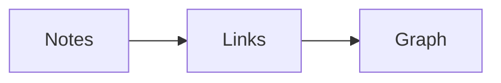

# Welcome to Netherite

Netherite is a **local-first** notes app. Link ideas with [[Japan Trip|double brackets]], embed images like ![[ingot.png|120]], and tag things #ideas/writing.

> [!tip] Callouts work
> Use `> [!note]`, `> [!warning]` and friends.

## Math
Inline $e^{i\pi} + 1 = 0$ and a block:

$$
\int_0^\infty e^{-x^2}\,dx = \frac{\sqrt{\pi}}{2}
$$

## Diagram


## Tasks
- [x] Install Netherite
- [ ] Write the first note ^first-task
- [ ] Explore the ==graph view==

## Code
```swift
let vault = Vault(root: url)
print(vault.allFiles())
```

| Feature | Status |
| --- | :---: |
| Links | ✅ |
| Canvas | ✅ |

A footnote reference[^1] and a %%hidden comment%%.

[^1]: Footnotes render at the bottom.
