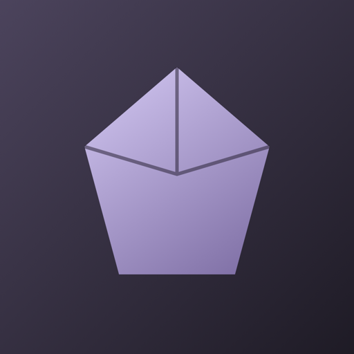

<div align="center">



# Netherite

**A native, local-first notes app for Mac, iPhone and iPad — your knowledge in plain Markdown files you own.**

[](LICENSE)


</div>

---

## 📖 Overview

Netherite is an alternative to [Obsidian](https://obsidian.md) built natively with SwiftUI for macOS, iOS and iPadOS. A **vault** is simply a folder of Markdown files, so your notes stay readable by any other app — including Obsidian itself, whose vaults, `[[wikilinks]]`, `.canvas` and `.base` files Netherite understands.

Writing happens in a **Live Preview** editor built on TextKit 2: formatting, tasks, callouts, tables, math and Mermaid diagrams render in place, and the Markdown only reappears on the line you're editing. Around the editor you get backlinks, a knowledge graph, an infinite canvas, database-like Bases, daily notes, templates and a full-text search with operators.

Vaults can live in **iCloud Drive** to sync between devices, or in any local folder. The app integrates with the rest of the system through a share-sheet web clipper, widgets, a Control Center control, App Intents/Shortcuts and Spotlight. A companion `netherite` command-line tool and a static-site publisher (with Cloudflare Pages deploys) round it out.

The interface is available in **English and Spanish**, follows Apple's Human Interface Guidelines, and includes a first-run tour, a guide vault that teaches every feature, and TipKit tips for features you haven't tried yet.

---

## ✨ Features

**Writing**
- **Live Preview editor** — headings, emphasis, highlights, links, tags, tasks with real checkboxes, bullets, callouts, tables, footnotes; `$$` math (KaTeX), Mermaid diagrams and `![[embeds]]` rendered inline
- **Reading view** — the whole note rendered to HTML with interactive tasks, embeds and syntax-highlighted code
- **Completions** — `[[` for links (including `#heading`), `#` for tags, `/` for slash commands and templates
- **Properties** — YAML frontmatter edited as typed fields (text, number, checkbox, date, list)

**Connecting ideas**
- **Links & backlinks** — `[[wikilinks]]`, Markdown links, heading and `^block` references, unlinked mentions, outgoing links, outline and footnotes panels
- **Rename-safe** — renaming or moving a note rewrites every link that points to it
- **Graph view** — global and local force-directed graph with filters, tag colouring and settings
- **Search** — full-text search with `tag:`, `path:`, `file:`, `line:`, `task:`, `[property:value]`, `"phrases"`, `-exclusions`, `OR` and `/regex/`

**Organizing & visual thinking**
- **Canvas** — infinite board of text, note, web and group cards with connections ([JSON Canvas](https://jsoncanvas.org) compatible)
- **Bases** — `.base` files that filter, sort and edit notes by their properties in table, cards or list views
- **Core plugins** — daily notes, templates, unique note creator, bookmarks, workspaces, random note, note composer (merge/extract), slides, audio recorder, web viewer, page preview and file recovery snapshots

**Everywhere**
- **iCloud Drive sync** or any local folder; Obsidian vaults open as-is
- **Share extension** web clipper, **widgets** (daily note, recent notes), **Control Center** control, **Shortcuts / Siri** actions and **Spotlight** indexing
- **Importer** for Evernote (`.enex`), Notion exports, HTML / Apple Notes exports and Markdown folders, plus an Obsidian-style format converter
- **Publish** — export a static site (search, graph, tag pages, backlinks) and deploy it to Cloudflare Pages
- **`netherite` CLI** — list, search, create, daily notes, backlinks, tags, export and publish from the terminal
- **Themes** — JSON themes in `.netherite/themes/`, light and dark

---

## 🛠 Tech Stack

| Layer | Technology |
|-------|-----------|
| App & UI | Swift 6, SwiftUI (macOS 26, iOS/iPadOS 26), TextKit 2, WebKit, TipKit |
| Core library | `NetheriteCore` Swift package (vault, OFM parser, index, search, render, canvas, bases, import, publish) |
| Markdown | [swift-markdown](https://github.com/swiftlang/swift-markdown) |
| YAML | [Yams](https://github.com/jpsim/Yams) |
| CLI | [swift-argument-parser](https://github.com/apple/swift-argument-parser) |
| Rendering (bundled) | [KaTeX](https://katex.org), [Mermaid](https://mermaid.js.org), [highlight.js](https://highlightjs.org) |
| System integration | App Intents, WidgetKit, CoreSpotlight, Share Extension, iCloud Drive |
| Project generation | [XcodeGen](https://github.com/yonaskolb/XcodeGen) (`project.yml`) |
| Publishing target | Cloudflare Pages (Direct Upload API) |

---

## 📋 Requirements

- **macOS** with **Xcode 27** or later (Swift 6 toolchain, macOS 26 and iOS 26 SDKs)
- **XcodeGen** — `brew install xcodegen`
- **Git**
- An **Apple Developer team** only if you want iCloud sync, the App Group, widgets and the share extension to work (see [Signing](#-signing))

---

## 🚀 Getting Started

### 1. Clone the repository

```bash
git clone https://github.com/Im-Fran/Netherite.git
cd Netherite
```

### 2. Generate the Xcode project

The `.xcodeproj` is generated from `project.yml` and isn't committed:

```bash
xcodegen generate
```

### 3. Open and run

```bash
open Netherite.xcodeproj
```

Select the **Netherite** scheme, choose **My Mac** or an iOS/iPadOS simulator, and run (⌘R). Swift Package Manager resolves the dependencies on first build.

On first launch you'll see the welcome tour and the start page. Pick **Explore the Guide** to create a vault that teaches every feature, or open the sample vault in `Fixtures/SampleVault`.

### Building from the command line

```bash
# macOS
xcodebuild -project Netherite.xcodeproj -scheme Netherite \
  -destination 'platform=macOS' -derivedDataPath build build

# iOS Simulator
xcodebuild -project Netherite.xcodeproj -scheme Netherite \
  -destination 'generic/platform=iOS Simulator' -derivedDataPath build build
```

Add `CODE_SIGNING_ALLOWED=NO` to build without a signing identity.

---

## 🔏 Signing

`DEVELOPMENT_TEAM` is empty in `project.yml`. Set your team in Xcode (or in `project.yml`, then regenerate) and make sure your provisioning profiles include:

| Capability | Identifier |
|------------|-----------|
| App bundle | `cl.franciscosolis.netherite` (+ `.share`, `.widgets`) |
| iCloud Documents container | `iCloud.cl.franciscosolis.netherite` |
| App Group | `group.cl.franciscosolis.netherite` |

Without a team the app still builds and works with local vaults; iCloud sync, widgets and the share extension need the entitlements above.

---

## 🧪 Tests

The core library has a Swift Testing suite (parser, index, links, search, rendering, templates, canvas, bases, import, publish, guide vault):

```bash
cd Packages/NetheriteCore
swift test
```

---

## ⌨️ Command-line tool

The `netherite` CLI ships in the core package and works on any vault folder:

```bash
cd Packages/NetheriteCore

swift run netherite list <vault>
swift run netherite search <vault> tag:project "exact phrase"
swift run netherite new <vault> "Meeting notes" --folder Work --content "# Agenda"
swift run netherite daily <vault>
swift run netherite backlinks <vault> "Some note"
swift run netherite tags <vault>

# Static site
swift run netherite export <vault> --out ./site [--folder Notes] [--only-published] [--home Welcome.md]

# Export and deploy to Cloudflare Pages
CLOUDFLARE_API_TOKEN=... swift run netherite publish <vault> --out ./site \
  --account <cloudflare-account-id> --project <pages-project-name>
```

The API token needs the **Cloudflare Pages: Edit** permission. In the app, the token is stored in the Keychain, never in the vault.

---

## ⚙️ Configuration

Per-vault settings live inside the vault, so they sync with it:

| File | Purpose |
|------|---------|
| `.netherite/app.json` | Editor, files, daily notes, templates, unique notes and file-recovery settings |
| `.netherite/themes/*.json` | Custom themes (accent, link, tag, highlight colours; fonts; scale) |
| `.netherite/bookmarks.json` | Bookmarks |
| `.netherite/workspaces.json` | Saved window layouts |
| `.netherite/graph.json` | Graph view settings |
| `.netherite/publish.json` | Publish options (scope, home note, Cloudflare account and project) |

File-recovery snapshots are kept outside the vault, in the app's Application Support folder.

Deep links are available through the `netherite://` scheme: `open?path=Folder/Note.md`, `new?name=…&content=…`, `daily`, `search?query=…` and `guide`.

---

## 🗂 Project Structure

```
Netherite/                 SwiftUI app (macOS + iOS/iPadOS)
  App/                     App, window and vault state
  Features/                Editor, Reader, Graph, Canvas, Bases, Inspector, Onboarding, …
  Intents/                 App Intents and Shortcuts
  Resources/               Assets and String Catalogs (en, es)
Packages/NetheriteCore/    Core library, `netherite` CLI and tests
ShareExtension/            Share-sheet web clipper
Widgets/                   WidgetKit widgets and Control Center control
Fixtures/SampleVault/      Sample vault used for manual testing
project.yml                XcodeGen project definition
```

---

## 🕸 Codebase knowledge graph (graphify)

We use [graphify](https://github.com/safishamsi/graphify) to keep a navigable **knowledge graph of this codebase**. It parses every Swift file into nodes (types, functions, files) and edges (calls, references), adds the concepts described in the docs, and clusters everything into communities such as *Vault Index & Link Graph* or *Canvas Surface & Model*. The result makes it easy — for people and for AI coding agents — to answer questions like "what depends on `VaultIndex`?" without reading the whole source tree.

```bash
uv tool install graphifyy          # or: pipx install graphifyy

graphify update .                  # rebuild the graph from code (AST only, no LLM or API cost)
graphify query "how does renaming a note update its links?"
graphify path "NoteEditorView" "VaultIndex"
graphify explain "WindowState"
```

Outputs go to `graphify-out/`, which is ignored by git and regenerated locally:

| File | What it is |
|------|-----------|
| `graph.html` | Interactive graph — open it in a browser |
| `GRAPH_REPORT.md` | Core abstractions ("god nodes"), communities and surprising connections |
| `graph.json` | Raw graph data for queries and other tools |

In [Claude Code](https://claude.com/claude-code), `/graphify .` runs the full pipeline (including the semantic pass over docs and images) and `CLAUDE.md` tells the agent to query the graph before browsing sources. Vendored, minified assets (`Resources/Web/*.min.js`) are left out of the graph because they would drown the project's own code.

---

## 🤝 Contributing

Contributions are welcome:

1. Fork the repository
2. Create a branch: `git checkout -b feat/your-feature`
3. Make sure `swift test` passes and the app builds for macOS and iOS
4. Commit using [Conventional Commits](https://www.conventionalcommits.org): `git commit -m "feat: add your feature"`
5. Push and open a pull request

---

## 📄 License

Netherite is free software, licensed under the **GNU General Public License v3.0** — see the [LICENSE](LICENSE) file for details.

Bundled third-party libraries keep their own licenses (KaTeX, Mermaid and highlight.js license files are in `Packages/NetheriteCore/Sources/NetheriteCore/Resources/Web/`).

Netherite is an independent project and is not affiliated with or endorsed by Obsidian.

---

<div align="center">
Made with ☕ by <a href="https://franciscosolis.cl">Fran</a>
</div>
